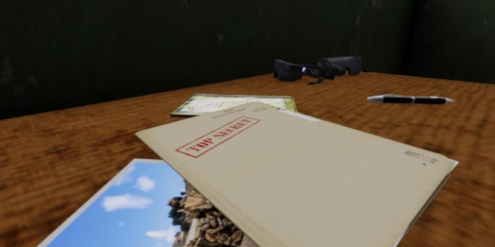

# CPC-CO[12]-Trooper.Enoch

> "The screams of pain as my comrades fall"
> -- Iron Maiden, 1983

## Contexte

### 24 Juin 2015 - 04:30 | Ukraine | _Avant poste Anglais_

La guerre du Donbass fait rage depuis le début de l'année dernière. Un accord avait été trouvé en Septembre mais quelqu'un a tiré trop vite et depuis Janvier, les combats recommence à s'intensifier

En Février, M. Hollande et Mme Merkel se sont déplacés en Russie et en Ukraine pour négocier un nouveau plan de paix. Pas de bol pour les grenouilles, leur président est jamais revenu et les Kommando ont pas tout à fait apprécié de devoir récupérer leur Chancelière en Huey suite à la prise d'otage de Irpin (près de Kiev).

Du coup nous voilà en Ukraine, comme bientôt la moitié des forces Européennes, pour calmer le jeu entre l'Ukraine et les Républiques populaires. Enfin ça c'était si les Russes avaient pas considéré qu'ils allaient récupérer un peu plus que la Crimée et avaient lancé une invasion...

Le gros problème c'est que les forces de la coalition (l'Ukraine et nous) avaient pas vraiment prévu ça : on est en sous nombre face au rouleau compresseur rouge. Des renforts sont en route mais ils mettront plusieurs semaines à arriver...

Et face à tout le monde, une partie de la population locale s'oppose aux Russes et aux Européens et cherchent à 'libérer le pays eux même'. C'est justement eux à qui on va remonter les bretelles aujourd'hui.

## Mission

C'est donc dans ce joyeux bazar que je vous informe que les rebelles du coin de _Bielawa_ on réussi a se procurer des informations hautement confidentielles sur la coalition et cherchent à les vendre aux Russes.

Bien évidemment c'est vous qui allez devoir récupérer les nudes de la reine et ramenez leur chef ici, vivant ou mort peu m'importe.
Pour enfoncer le clou, la transaction est prévue pour tôt ce matin, et la météo n'est pas de notre coté.

Aux dernières nouvelles, les rebelles se sont planqués dans une _ferme près de Bielawa_.

### Objectifs :

- Éliminez ou ramenez le HVT
- Récupérez les documents

Accomplissement des objectifs à l'appréciation du chef d'escouade.
Coupure de la mission avec la commande radio 0-0-1 (victoire) ou 0-0-2 (défaite).

## Crédits

Mission faite par OxyTom.

Merci à Shinriel, Morbakos (et sûrement d'autres) pour les tutos.
Merci à Sparfell, Mystery, Shinriel et Tanin pour GDC_lib.
Merci à tout les canards pour m'avoir inspiré
